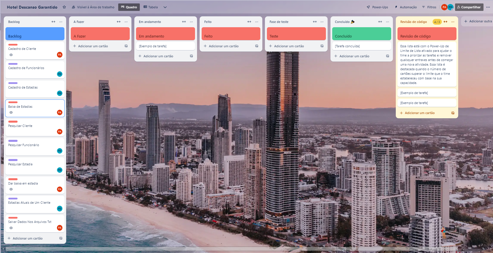
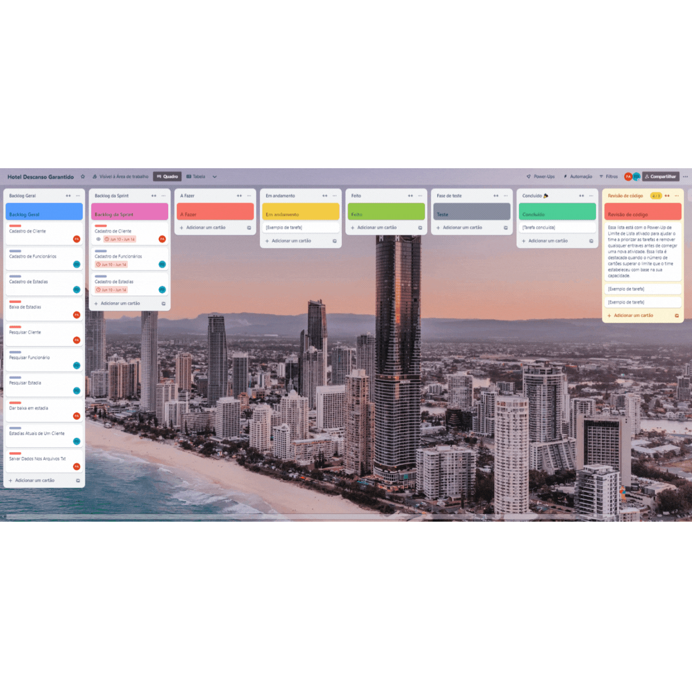
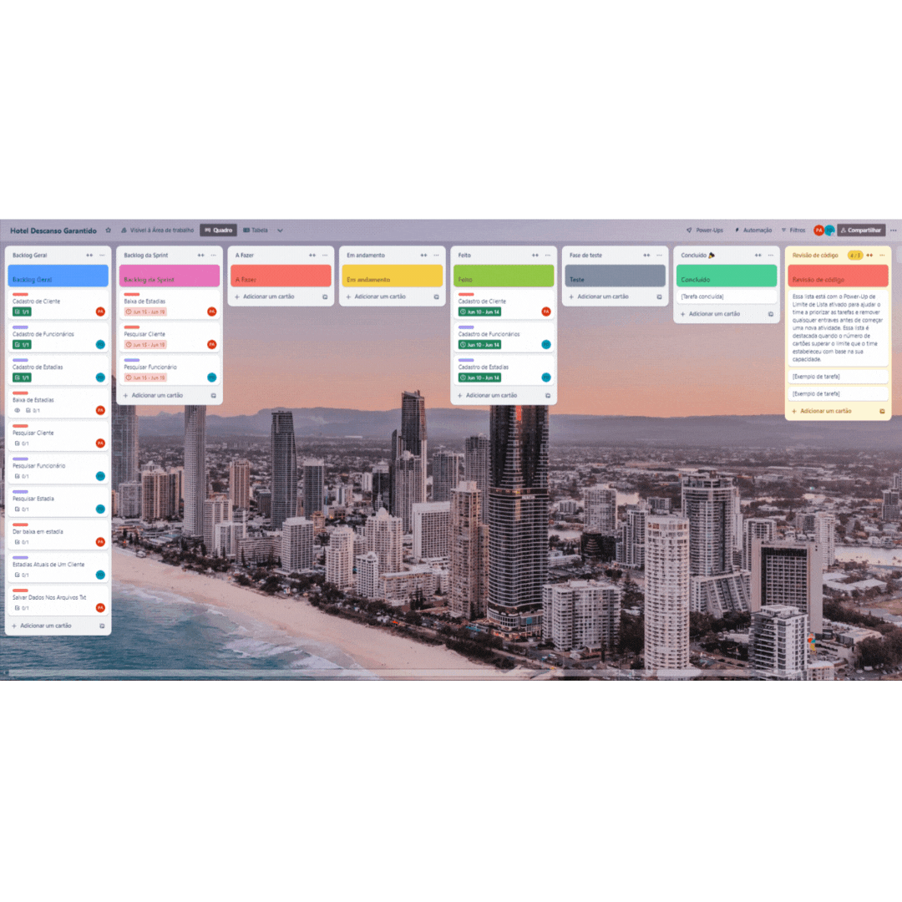
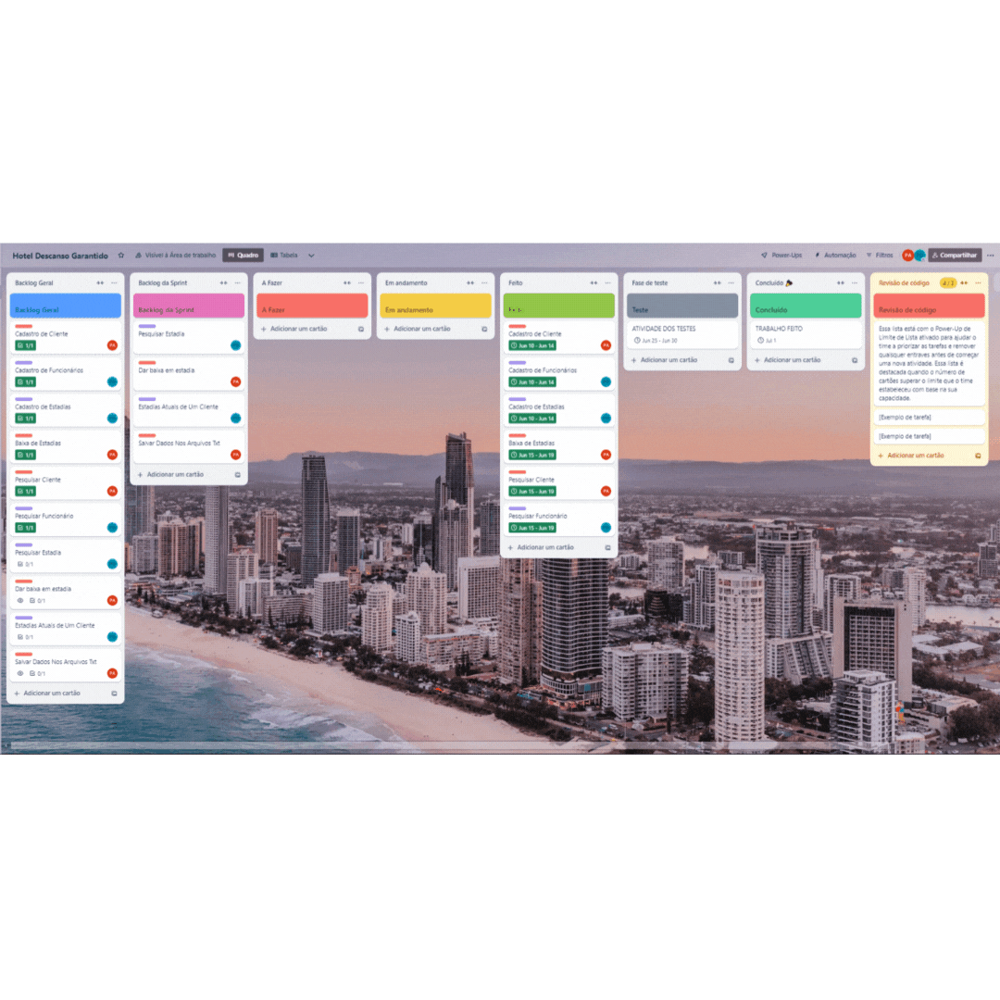
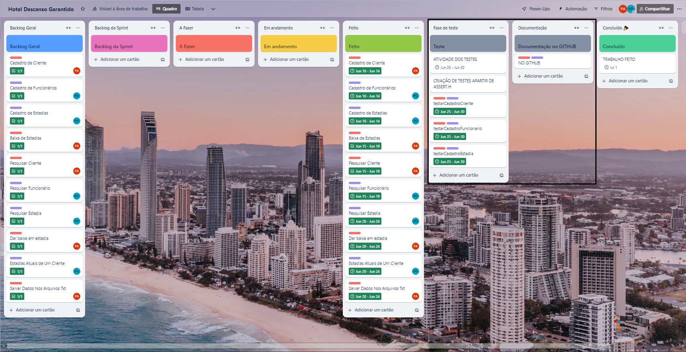
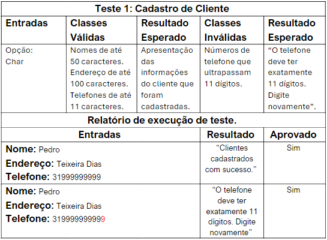
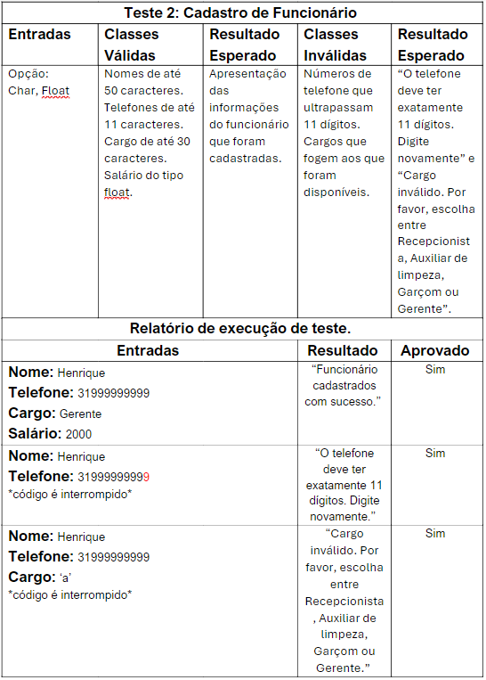
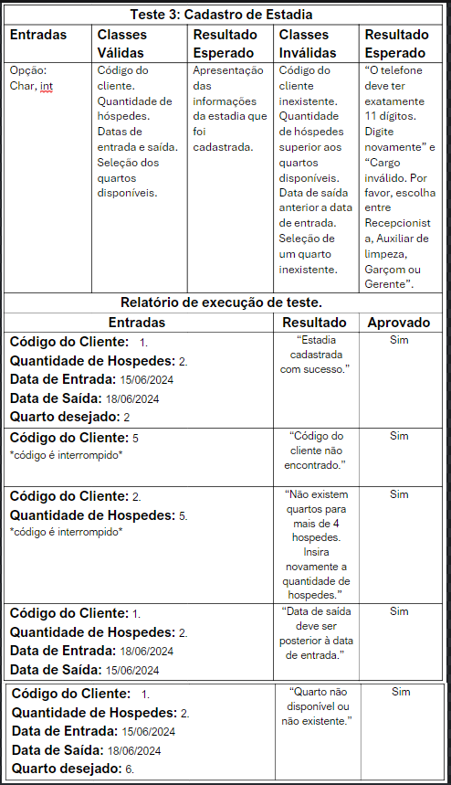

# TRABALHO-HOTEL-AEDS-1

## Projeto
Descanso Garantido é um hotel que tem como objetivo atender bem seus clientes, além disso, procura fideliza lós. Está localizado no centro de Itacaré – BA e possui alguns funcionários com seguintes cargos (Recepcionista, Auxiliar de limpeza, Garçom e Gerente), acontece que até hoje o Hotel Descanso Garantido fazia seus controles de estadias, clientes e funcionários em planilhas do Excel e cadernos, o que tem gerado diversos problemas para a organização.  Sem falar que muitas vezes um mesmo quarto é reservado para mais de um cliente. Diante dos problemas vividos pela Descanso Garantido, foi escolhido para resolver o seu problema um sistema em C.

## Bibliotecas Usadas
* **time.h**: Utilizada para demarcar as datas de entrada e saída dos hóspedes no hotel Descanso Garantido.
* **stdio.h**: Biblioteca padrão que fornece funções como printf e scanf, fundamentais para interação entre entrada e saída de dados.
* **stdlib.h**: Oferece funções para manipulação de memória, conversão de tipos, geração de números aleatórios e controle do ambiente de execução do software.
* **string.h**: Utilizado para manipulação de strings, exemplo cópia, concatenação, etc.
* **assert.h**: Utilizada para manipular os casos de teste, auxilia na confirmação de testes.

## Estrutura de Dados

* **typedef struct Cliente**: Armazena as informações dos clientes do hotel, incluindo código, nome, endereço e telefone.
* **typedef struct Funcionario**: Armazena as informações dos funcionários, incluindo código, nome, telefone, cargo e salário.
* **typedef struct Quarto**: Armazena as informações dos quartos, incluindo número, quantidade de hóspedes, valor da diária e status (ocupado/desocupado).
* **typedef struct Estadia**: Armazena as informações das estadias, incluindo código, data de entrada, data de saída, quantidade de diárias, código do cliente, número do quarto e valor total.

## Funções Utilizadas

* **void cadastrarCliente(Cliente clientes[], int *qtdClientes)**: é usada para adicionar novos clientes a um sistema de gerenciamento. Ela verifica se a quantidade atual de clientes atingiu o limite máximo ('MAX_CLIENTES') e, se esse for o caso, imprime uma mensagem de erro e interrompe o processo. Caso ainda haja espaço para mais clientes, a função cria uma nova estrutura 'Cliente' e atribui um código único ao novo cliente. Em seguida, solicita ao usuário que insira o nome, endereço e telefone do cliente, armazenando essas informações na estrutura recém-criada. Após coletar os dados, a função adiciona o novo cliente ao array clientes e incrementa o contador de clientes ('*qtdClientes'). Finalmente, ela confirma o cadastro bem-sucedido com uma mensagem ao usuário, indicando o código do cliente recém-adicionado.
  
* **void cadastrarFuncionario(Funcionario funcionarios[], int *qtdFuncionarios)**:  é utilizada para adicionar novos funcionários a um sistema de gerenciamento. Ela verifica se a quantidade atual de funcionários atingiu o limite máximo permitido e, se for o caso, imprime uma mensagem informando que não é possível cadastrar mais funcionários, interrompendo o processo. Se ainda houver espaço para mais funcionários, a função cria uma nova estrutura 'Funcionario' e atribui um código único ao novo funcionário. Em seguida, solicita ao usuário que insira os dados do funcionário, como nome, endereço e telefone, armazenando essas informações na estrutura criada. Depois de coletar os dados, a função adiciona o novo funcionário ao array 'funcionarios' e incrementa o contador de funcionários ('*qtdFuncionarios'). Por fim, a função confirma o cadastro com sucesso, exibindo uma mensagem ao usuário com o código do novo funcionário.

* **void salvarQuartoEmArquivo(Quarto quartos[], int qtdQuartos, int numeroQuarto, int codigoEstadia)**: salva os dados de um quarto em um arquivo chamado "quarto.txt" quando uma nova estadia é registrada. Ela percorre o array de quartos para encontrar o quarto específico baseado no número do quarto e, em seguida, escreve as informações desse quarto, junto com o código da estadia, no arquivo. Essa função é útil para manter um registro persistente das estadias dos quartos no sistema.

* **void cadastrarEstadia(Estadia estadias[], int *qtdEstadias, Cliente clientes[], int qtdClientes, Quarto quartos[], int qtdQuartos)**: registra uma nova estadia no sistema, incrementando o contador total de estadias. Ela realiza verificações para garantir que o quarto escolhido pelo cliente esteja disponível e calcula o custo total da estadia com base na tarifa do quarto e na duração da estadia. Essas operações são essenciais para manter a integridade dos registros e fornecer informações precisas sobre as estadias no sistema de gerenciamento.

* **void darBaixaEstadia(Estadia estadias[], int *qtdEstadias, Quarto quartos[], int qtdQuartos)**: finaliza uma estadia no sistema. Ela realiza duas operações essenciais para esse processo:
Primeiro, marca o quarto correspondente como desocupado no array quartos[]. Isso significa que o quarto fica disponível novamente para novas reservas ou uso.
Segundo, remove a estadia específica do array estadias[], ajustando o contador total de estadias (*qtdEstadias). Isso mantém a integridade dos registros no sistema, garantindo que apenas estadias ativas estejam presentes no sistema de gerenciamento.

* **void mostrarEstadiasCliente(Estadia estadias[], int qtdEstadias, Cliente clientes[], int qtdClientes)**: mostra todas as estadias de um cliente específico ao procurar pelo código do cliente no sistema. Ela percorre o array 'estadias[]' para encontrar todas as estadias associadas ao código do cliente fornecido. Em seguida, exibe as informações detalhadas de cada estadia encontrada para esse cliente, utilizando os dados armazenados nos arrays 'estadias[]' e 'clientes[]'.

* **void pesquisarCliente(Cliente clientes[], int qtdClientes)**: Pesquisa um cliente pelo código ou nome, exibindo suas informações se encontrado.

* **void pesquisarFuncionario(Funcionario funcionarios[], int qtdFuncionarios)**: Pesquisa um funcionário pelo código ou nome, exibindo suas informações se encontrado.

* **void pesquisarEstadia(Estadia estadias[], int qtdEstadias)**: Pesquisa uma estadia pelo código, exibindo suas informações se encontrada.

* **void salvarDados(Cliente clientes[], int qtdClientes, Funcionario funcionarios[], int qtdFuncionarios, Estadia estadias[], int qtdEstadias)**: Salva os dados de clientes, funcionários e estadias em arquivos correspondentes ("clientes.txt", "funcionarios.txt", "estadias.txt").

* **void carregarDados(Cliente clientes[], int *qtdClientes, Funcionario funcionarios[], int *qtdFuncionarios, Estadia estadias[], int *qtdEstadias)**: PCarrega os dados de clientes, funcionários e estadias a partir dos arquivos correspondentes.

## Casos de Teste

* **void testarCadastroCliente()**: A função testarCadastroCliente testa o cadastro de clientes em um sistema, redirecionando a entrada padrão para ler dados de um arquivo e executando a função "cadastrarCliente" para adicionar clientes a um array. Após verificar o número de clientes cadastrados, ela imprime e valida os dados de cada cliente usando asserções.
* **void testarCadastroFuncionario()**: A função "testarCadastroFuncionario" lê dados de funcionários de um arquivo "funcionarioTeste.txt" e os cadastra em um array até atingir o limite "MAX_FUNCIONARIOS". Para cada funcionário, são validados nome, telefone, cargo e salário, atribuindo um código sequencial. Caso a leitura dos dados falhe ou os dados sejam inválidos, uma mensagem de erro é exibida. Se não houver dados suficientes, funcionários já cadastrados são duplicados automaticamente para preencher o array. Ao final, a lista de funcionários cadastrados é impressa e verificada.
* **void testarCadastroEstadia()**: A função "testarCadastroEstadia" lê dados de estadias de um arquivo "estadiaTestes.txt" e cadastra essas estadias em um array, verificando se estão preparadas corretamente. Clientes e quartos são previamente definidos, e as estadias são cadastradas e impressas com suas informações. Após o cadastro inicial, a função testa o cadastro de estadias especificamente para cada quarto, reiniciando o array e lendo novamente o arquivo para cada quarto, garantindo que estadias são corretamente atribuídas e exibidas para cada quarto.
  

## MENU

    Hotel Descanso Garantido
    __________________________
    1. Cadastrar Cliente
    2. Cadastrar Funcionario
    3. Cadastrar Estadia
    4. Pesquisar Cliente
    5. Pesquisar Funcionario
    6. Pesquisar Estadia
    7. Dar Baixa em Estadia
    8. Mostrar Estadias de Cliente
    9. Salvar e Sair
    10. Aba de testes

* Possivel escolher e navegar pelas diferentes interfaces e funções da aplicação.

## ARQUIVOS TXT

* Os arquivos txt possuem a seguinte lógica em sua escrita.
* Clientes: Id, Nome, Endereço, Telefone
* Funcionários: Id, Nome, Cargo, Telefone, Salário.
* Estadias: Id, Data de Entrada, Data de saída, Diárias, Código do cliente hospedado, Número de Hospedes, Valor total.
* Quartos: Tipo de quarto, Capacidade de pessoas, Valor da Diária, Ocupado/Desocupado, Id.
* **Os arquivos de teste, possuem entradas que serão lidas e usadas como base para efetuar os testes.**

## Métodos Ágeis 

Para a confecção de um ótimo trabalho pautado nas boas práticas da engenharia de software, utilizamos o **Scrum** e o **Kanban**
* **Scrum**:O framework Scrum, nos auxiliou a organizar o projeto em sprints de aproximadamente 5 dias, onde efetuamos as suas cerimônias criteriosamente. Planejávamos a sprint e definíamos qual seria o backlog da mesma. Realizávamos ¨*daily's* com durações aproximadas de 5 a 8 minutos. Ao final de cada sprint, revisávamos o que tinha sido concluído e entregue ao cliente e, por fim, revisávamos a maneira como trabalhamos para buscar melhorias no processo.
*  **Kanban**:  Utilizamos o trello para fazer o acompanhamento visual do projeto através do framework Kanban onde organizamos os requisitos, o backlog do produto, backlog da sprint e separavámos as tarefas da sprint no quadro *To-do, Doing, Done*.

## Evolução das Sprints

Abaixo é possível acompanhar a organização das sprints feita apartir do trello.

**Backlog Geral**

**Sprint 1**

**Sprint 2**

**Sprint 3**

**Sprint 4**

## Relatório de testes.

Em anexo, temos tabelas que representam os relatórios de testes, neles é possível ver as entradas, classes válidas, classes inválidas e os resultados esperados.

    
    
    

## Vídeo Apresentando o Projeto.
<a href="ExecucaoTeste/TrabalhoAEDs-VIDEO.mp4"> Vídeo Aqui </a>  

<a href="https://www.youtube.com/watch?v=lir3JpTPPFs"> Vídeo no YouTube Aqui </a>

